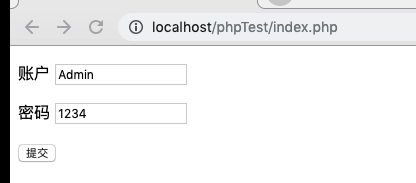
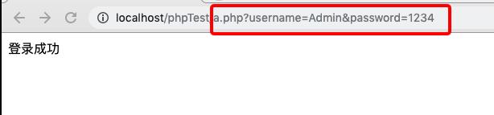
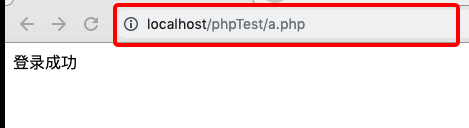

### 课程概要

* 初始PHP
* OO的概念解读以及Prototype
* PHP和JavaScript的比较


#### 一、初始PHP

PHP - 超文本预处理器，是一种通用开源脚本语言。PHP可以执行编译后代码，编译可以达到加密和优化代码运行，使代码运行更快 

``` php
<?php

if(1>2) {
  echo "我的第一段PHP脚本";
} else {
  echo "Hello PHP";
}

?>
```

> 输出结果为：Hello PHP

**1、声明变量**
```php
<?php

$a = "测试";
echo $a;

?>
```
> 若没有 $,则会报错`（Parse error: syntax error, unexpected '=' in /Applications/XAMPP/xamppfiles/htdocs/phpTest/index.php on line XX）`

**2、块级作用域**
```php
<?php

if (false) {
  $a = '测试'
}
echo $a;

?>
```
> 这段代码有误，php是有块级作用域，echo $a获取不到。

*如何判断作用域*
```php
<?php

if (false) {
  $a = '测试'
}
if (isset($a)) {
  echo '我是一个声明的';
} else {
  echo '我是未声明的'
}

?>
```
> echo '我是未声明的';

*声明全局变量*
```php
<?php

$a = 'global 全局的';
function test() {
  global $a;
  echo $a;
}
test();

?>
```
> echo 'global 全局的';

**3、引入外部php文件**

```php
require_once('b.php');
// include_once('b.php');

$a = 'global 全局的';
function test() {
  global $a;
  echo $a;
}
test();
echo $GLOBALS['b'];

?>

或者

// require_once('b.php');
include_once('b.php');

$a = 'global 全局的';
function test() {
  global $a;
  echo $a;
}
test();
echo $GLOBALS['b'];

?>
```
> require_once 和 include_once 即可。但是，若 b.php文件不真实存在，以上代码，require_once 会报错并且`echo $a`也不输出。但 include_once 也会报错, 但会正常输出 `echo $a` 的值。

**4、数组**
```php
<?php

$data = array('0'=> '苹果','1'=>'测试');
echo json_encode($data, JSON_UNESCAPED_UNICODE);

echo json_encode($data[0], JSON_UNESCAPED_UNICODE);

?>
```
> 若不加入`JSON_UNESCAPED_UNICODE`,则不能进行中文编码。待考究是否有统一的处理方法.

> echo ["苹果","测试"]
> echo "苹果"

#### 二、PHP 表单初体验
> a.php 文件设置登录信息
```php
<?php

header('content-type: text/html; charset=utf-8');

$username = $_GET['username'];
if ($username === 'Admin') {
  echo '登录成功';
} else {
  echo '登录失败';
}

?>
```

> index.php 页面展示

```html
<form action="a.php" method="get">
  <p>
    <label>账户</label>
    <input type="text" name="username"></input>
  </p>

  <p>
    <label>密码</label>
    <input type="text" name="password"></input>
  </p>
  <input type="submit" value="提交"></input>
</form>
```

**预览效果**

> index.php 点击提交



> a.php 显示结果



*以上代码为get请求，若改为post请求，区别在于，地址不会携带用户名和密码的信息*

